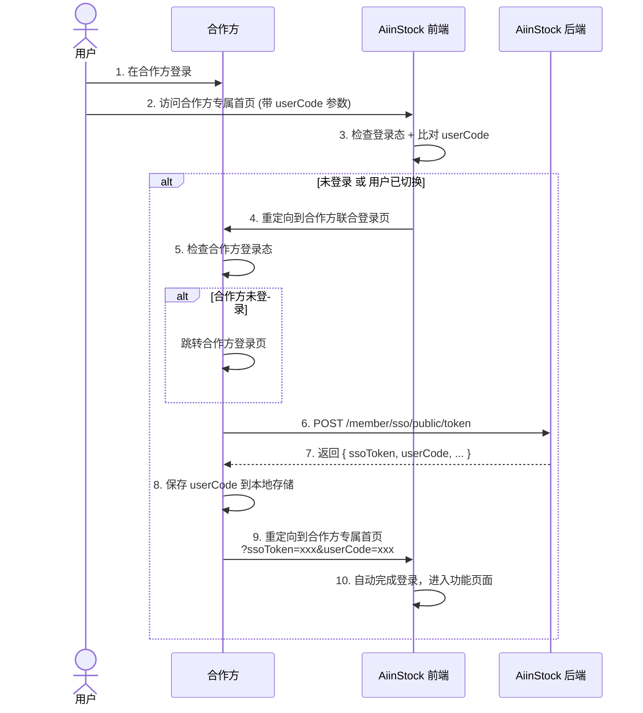
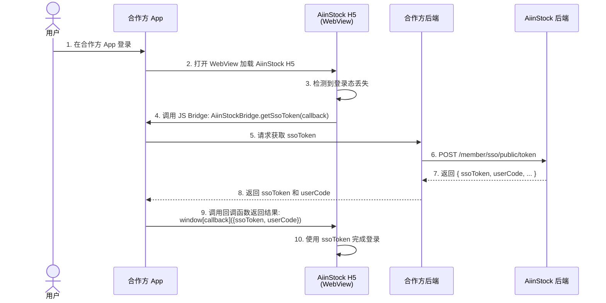
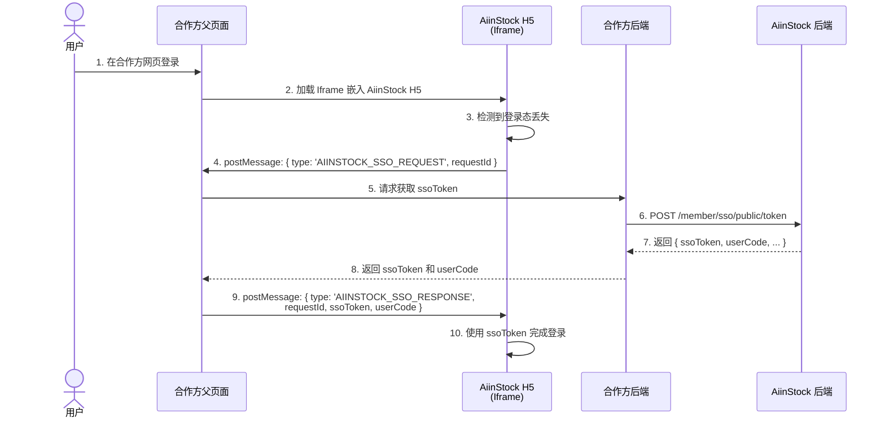

# AiinStock SSO 接入文档

> 本文档面向合作方技术团队，说明如何通过 SSO 接口实现用户互通。

## 1. 概述

AiinStock 提供 SSO（单点登录）能力，合作方通过服务端接口获取一次性 SSO Token，然后将 Token 传递给 AiinStock 前端完成自动登录。

### 接入方式

根据合作方的技术场景，AiinStock 支持两种接入方式：

| 方式 | 适用场景 | 通信机制 | 说明 |
|------|----------|----------|------|
| **URL 重定向** | 独立浏览器页面 | 页面跳转 + URL 参数 | 传统 Web 应用，通过页面重定向传递 ssoToken |
| **消息通信** | App WebView / 浏览器 Iframe | JS Bridge / postMessage | 嵌入式场景，无需页面跳转，通过消息通信获取 ssoToken |

- **URL 重定向方式**：详见[第3.1节 接入流程](#31-方式一url-重定向独立浏览器页面)
- **App WebView 方式**：详见[第3.2节 接入流程](#32-方式二app-webviewjs-bridge)，实现代码见[第10.3节](#103-js-bridge-规范app-webview-场景)
- **浏览器 Iframe 方式**：详见[第3.3节 接入流程](#33-方式三浏览器-iframepostmessage)，实现代码见[第10.4节](#104-postmessage-规范浏览器-iframe-场景)

### 合作模式

| 模式 | 说明 | 用户归属 |
|------|------|----------|
| **租户模式 (TENANT)** | 用户隔离在合作方名下，同一邮箱在不同租户下独立 | 租户用户（tenant_id = 合作方ID） |
| **引流模式 (REFERRAL)** | 用户为 AiinStock 平台用户，仅记录邀请来源 | 平台用户（tenant_id = NULL） |

## 2. 接入准备

### 2.1 获取凭证

联系 AiinStock 运营团队获取以下信息：

| 参数 | 说明 |
|------|------|
| `apiKey` | API Key（用于 API 调用，64位字符串） |
| `apiSecret` | API Secret（用于签名，64位字符串，**不可泄露**） |

### 2.2 环境地址

**API 地址**

| 环境 | API 地址                          |
|------|---------------------------------|
| 测试环境 | `https://dev-api.aiinstock.com` |
| 生产环境 | `https://api.aiinstock.com`     |

**前端地址（合作方专属域名）**

AiinStock 会为每个合作方分配专属的二级域名，或合作方可提供自定义域名及域名证书。

| 环境 | 域名格式 | 示例 |
|------|---------|------|
| 测试环境 | `https://{partner}-dev.aiinstock.com` | `https://tradingbase-dev.aiinstock.com` |
| 生产环境 | `https://{partner}.aiinstock.com` | `https://tradingbase.aiinstock.com` |
| 自定义域名 | 合作方自行提供 | `https://stock.partner.com` |

### 2.3 AiinStock 页面说明

合作方专属域名的首页即为 SSO 登录入口，通过 URL 参数传递登录信息：

| 参数 | 说明 |
|------|------|
| `ssoToken` | SSO Token（首次登录或用户切换时传递） |
| `userCode` | 用户编号（用于检测用户切换） |

**URL 格式**

```
https://{合作方专属域名}/?ssoToken=xxx&userCode=xxx
```

**示例**

- 测试环境：`https://tradingbase-dev.aiinstock.com/?ssoToken=a1b2c3d4&userCode=123456`
- 生产环境：`https://tradingbase.aiinstock.com/?ssoToken=a1b2c3d4&userCode=123456`

### 2.4 需要合作方提供

**URL 重定向方式（独立浏览器页面）**

| 项目 | 必填 | 说明 |
|------|------|------|
| 联合登录页面 URL | 是 | 当用户未登录时，AiinStock 首页会重定向到此地址 |
| 自定义域名 | 否 | 如需使用自有域名，需提供域名及 SSL 证书 |

**消息通信方式（App WebView / 浏览器 Iframe）**

| 项目 | 必填 | 说明 |
|------|------|------|
| 联合登录页面 URL | 否 | 无需提供，通过 JS Bridge 或 postMessage 获取 ssoToken |
| 自定义域名 | 否 | 如需使用自有域名，需提供域名及 SSL 证书 |
| JS Bridge 实现 | 是 | App 需实现 `AiinStockBridge` 对象，详见[第10.3节](#103-js-bridge-规范app-webview-场景) |
| postMessage 监听 | 是 | Iframe 父页面需监听 `AIINSTOCK_SSO_REQUEST` 消息，详见[第10.4节](#104-postmessage-规范浏览器-iframe-场景) |

## 3. 接入流程

根据不同的技术场景，选择对应的接入流程。具体实现代码请参考[第10节 前端集成方案](#10-前端集成方案app-iframe-场景)。

### 3.1 方式一：URL 重定向（独立浏览器页面）

适用于：传统 Web 应用，用户通过独立浏览器页面访问 AiinStock。



**步骤说明**

| 步骤 | 角色 | 说明 |
|------|------|------|
| 1 | 用户 | 在合作方完成登录 |
| 2 | 用户 | 点击入口进入 AiinStock（合作方负责拼接 `userCode` 参数） |
| 3 | AiinStock 前端 | 检查本地登录态，并比对 URL 中的 `userCode` 与已登录用户的 `userCode` |
| 4 | AiinStock 前端 | 若未登录或 userCode 不匹配，重定向到合作方联合登录页 |
| 5 | 合作方 | 联合登录页面检查用户是否仍处于登录态，若未登录则跳转登录页 |
| 6 | 合作方 | 调用 AiinStock SSO Token 接口，传入 apiKey、用户邮箱等信息 |
| 7 | AiinStock 后端 | 返回一次性 ssoToken 和 userCode（ssoToken 5分钟有效） |
| 8 | 合作方 | 将 `userCode` 保存到本地存储，与合作方用户关联 |
| 9 | 合作方 | 重定向到合作方专属首页：`https://{domain}/?ssoToken=xxx&userCode=xxx` |
| 10 | AiinStock 前端 | 从 URL 取出 ssoToken，自动完成登录，进入功能页面 |

### 3.2 方式二：App WebView（JS Bridge）

适用于：合作方 App 中通过 WebView 嵌入 AiinStock H5 页面。



**步骤说明**

| 步骤 | 角色 | 说明 |
|------|------|------|
| 1 | 用户 | 在合作方 App 完成登录 |
| 2 | 合作方 App | 打开 WebView 加载 AiinStock H5 页面 |
| 3 | AiinStock H5 | 检测到本地无登录态或登录态已过期 |
| 4 | AiinStock H5 | 调用 JS Bridge 请求 ssoToken |
| 5 | 合作方 App | 调用合作方后端接口（**apiSecret 存储在后端**） |
| 6 | 合作方后端 | 调用 AiinStock API 获取 ssoToken |
| 7 | AiinStock 后端 | 返回 ssoToken 和 userCode |
| 8 | 合作方后端 | 将 ssoToken 和 userCode 返回给 App |
| 9 | 合作方 App | 通过 JS Bridge 回调将结果返回给 WebView |
| 10 | AiinStock H5 | 使用 ssoToken 调用登录接口，完成自动登录 |

> **实现代码**：详见[第10.3节 JS Bridge 规范](#103-js-bridge-规范app-webview-场景)

### 3.3 方式三：浏览器 Iframe（postMessage）

适用于：合作方网页中通过 Iframe 嵌入 AiinStock H5 页面。



**步骤说明**

| 步骤 | 角色 | 说明 |
|------|------|------|
| 1 | 用户 | 在合作方网页完成登录 |
| 2 | 合作方父页面 | 加载 Iframe 嵌入 AiinStock H5 页面 |
| 3 | AiinStock H5 | 检测到本地无登录态或登录态已过期 |
| 4 | AiinStock H5 | 通过 postMessage 向父页面请求 ssoToken |
| 5 | 合作方父页面 | 调用合作方后端接口（**apiSecret 存储在后端**） |
| 6 | 合作方后端 | 调用 AiinStock API 获取 ssoToken |
| 7 | AiinStock 后端 | 返回 ssoToken 和 userCode |
| 8 | 合作方后端 | 将 ssoToken 和 userCode 返回给父页面 |
| 9 | 合作方父页面 | 通过 postMessage 将结果返回给 Iframe |
| 10 | AiinStock H5 | 使用 ssoToken 调用登录接口，完成自动登录 |

> **实现代码**：详见[第10.4节 postMessage 规范](#104-postmessage-规范浏览器-iframe-场景)

### 3.4 userCode 机制说明

`userCode` 是 AiinStock 为每个用户生成的唯一标识，用于检测用户切换场景。**此机制仅适用于 URL 重定向 和 Iframe方式**，App WebView 场景无需关注。

**为什么需要传递 userCode？**

用户在合作方页面可能会切换账号（如退出后换另一个账号登录）。当用户再次进入 AiinStock 页面时，AiinStock 前端需要感知到"当前合作方用户"与"已登录的 AiinStock 用户"是否一致。如果不一致，需要重新走 SSO 登录流程。

**合作方需要做的事情：**

1. **首次访问**：调用 SSO Token 接口后，将返回的 `userCode` 保存到本地存储（如数据库），与合作方用户关联
2. **后续访问**：跳转到合作方专属首页时，从本地存储取出该用户的 `userCode`，拼接到 URL 参数中：
   ```
   https://tradingbase-dev.aiinstock.com/?userCode=123456
   ```
3. **首次访问或用户切换**：需要同时传递 `ssoToken` 和 `userCode`：
   ```
   https://tradingbase-dev.aiinstock.com/?ssoToken=a1b2c3d4&userCode=123456
   ```

**AiinStock 前端的处理逻辑：**

1. 从 URL 获取 `userCode` 参数
2. 从本地登录态获取当前已登录用户的 `userCode`
3. 如果两者不一致，或本地未登录，则重定向到合作方联合登录页
4. 如果 URL 中有 `ssoToken`，则使用该 token 完成自动登录

## 4. 接口说明

### 4.1 获取 SSO Token

合作方服务端调用此接口获取一次性 SSO Token。

**请求**

```
POST /member/sso/public/token
Content-Type: application/json
X-API-Key: {apiKey}
```

**请求头**

| Header | 必填 | 说明 |
|--------|------|------|
| X-API-Key | 是 | API Key（64位字符串） |

**请求参数**

| 参数 | 类型 | 必填 | 说明 |
|------|------|------|------|
| email | String | 是 | 用户邮箱（作为唯一标识） |
| nickname | String | 否 | 用户昵称（新用户创建时使用） |
| walletAddress | String | 否 | 钱包地址 |
| timezone | String | 否 | 用户时区（IANA 时区标识，如 `Asia/Shanghai`、`America/New_York`） |
| language | String | 否 | 用户语种（ISO 639-1 语言代码，如 `zh-CN`、`en-US`、`ja-JP`） |
| timestamp | Long | 是 | 当前时间戳（毫秒），5分钟内有效 |
| nonce | String | 是 | 随机字符串（UUID），防重放 |
| sign | String | 是 | HMAC-SHA256 签名（**apiKey 不参与签名**，详见[签名算法](#5-签名算法)） |

**请求示例**

```http
POST /member/sso/public/token HTTP/1.1
Content-Type: application/json
X-API-Key: a1b2c3d4e5f6g7h8i9j0k1l2m3n4o5p6q7r8s9t0u1v2w3x4y5z6a7b8c9d0e1f2

{
  "email": "user@example.com",
  "nickname": "张三",
  "timezone": "Asia/Shanghai",
  "language": "zh-CN",
  "timestamp": 1706400000000,
  "nonce": "550e8400-e29b-41d4-a716-446655440000",
  "sign": "a1b2c3d4e5f6..."
}
```

**响应参数**

| 参数 | 类型 | 说明 |
|------|------|------|
| code | Integer | 0=成功 |
| data.status | String | `CREATED`=新创建用户，`EXISTING`=已有用户 |
| data.ssoToken | String | SSO Token（一次性，5分钟有效） |
| data.userCode | Long | 用户编号 |
| data.expiresIn | Integer | 过期时间（秒） |

**响应示例**

```json
{
  "code": 0,
  "message": "success",
  "data": {
    "status": "CREATED",
    "ssoToken": "a1b2c3d4e5f6g7h8i9j0k1l2m3n4o5p6",
    "userCode": 123456,
    "expiresIn": 300
  }
}
```

### 4.2 重定向到合作方专属首页

获取到 ssoToken 和 userCode 后，合作方需要将用户重定向到合作方专属首页：

```
https://{合作方专属域名}/?ssoToken={ssoToken}&userCode={userCode}
```

**示例**：
- 测试环境：`https://tradingbase-dev.aiinstock.com/?ssoToken=a1b2c3d4e5f6g7h8&userCode=123456`
- 生产环境：`https://tradingbase.aiinstock.com/?ssoToken=a1b2c3d4e5f6g7h8&userCode=123456`

AiinStock 前端会自动处理后续的登录流程。

## 5. 签名算法

所有需要签名的接口，统一使用 HMAC-SHA256 签名。

### 5.1 签名规则

1. 将所有业务参数（**不含** `sign` 和 `apiKey`）按 **key 字母序升序** 排列
2. **非 ASCII 字符需进行百分比编码（percent-encoding）**，如中文字符、特殊符号等
3. 拼接为 `key1=value1&key2=value2&...` 格式
4. **值为空或 null 的参数不参与签名**
5. **`apiKey` 不参与签名计算**（仅通过 Header `X-API-Key` 传输）
6. 使用 `apiSecret` 作为密钥，对拼接字符串进行 HMAC-SHA256 签名
7. 签名结果转为小写十六进制字符串

> **百分比编码说明**：使用标准的 URL 编码（RFC 3986），例如：
> - 中文 `张三` 编码为 `%E5%BC%A0%E4%B8%89`
> - 空格编码为 `%20` 或 `+`
> - 特殊字符如 `@` 编码为 `%40`

### 5.2 签名示例

假设参数如下（`apiKey` 通过 Header `X-API-Key` 传输，**不参与签名**）：

```
apiKey = a1b2c3d4...（64位，仅通过 Header 传输，不参与签名）
email = user@example.com
language = zh-CN
nickname = 张三
nonce = 550e8400-e29b-41d4-a716-446655440000
timestamp = 1706400000000
timezone = Asia/Shanghai
```

**Step 1: 对非 ASCII 字符进行百分比编码**

- `nickname = 张三` → `nickname = %E5%BC%A0%E4%B8%89`

**Step 2: 按 key 字母序排列并拼接（不含 apiKey）**

```
email=user%40example.com&language=zh-CN&nickname=%E5%BC%A0%E4%B8%89&nonce=550e8400-e29b-41d4-a716-446655440000&timestamp=1706400000000&timezone=Asia%2FShanghai
```

> 注意：
> - **`apiKey` 不参与签名计算**，仅通过 Header 传输用于身份识别
> - 参数按字母序排列：`email` → `language` → `nickname` → `nonce` → `timestamp` → `timezone`
> - 所有参数值都需要进行百分比编码（ASCII 字符编码后不变，非 ASCII 字符会被转换）

**Step 3: HMAC-SHA256 签名**

```
sign = HMAC-SHA256(apiSecret, 待签名字符串)
```

**完整示例（Java）**：

```java
// 签名原文（已百分比编码）
String signString = "email=user%40example.com&language=zh-CN&nickname=%E5%BC%A0%E4%B8%89&nonce=550e8400-e29b-41d4-a716-446655440000&timestamp=1706400000000&timezone=Asia%2FShanghai";

// 使用 apiSecret 进行 HMAC-SHA256 签名
String sign = hmacSha256(apiSecret, signString);
```

## 6. 实现参考

### 6.1 Java 示例

```java
import javax.crypto.Mac;
import javax.crypto.spec.SecretKeySpec;
import java.net.URI;
import java.net.URLEncoder;
import java.net.http.HttpClient;
import java.net.http.HttpRequest;
import java.net.http.HttpResponse;
import java.nio.charset.StandardCharsets;
import java.util.UUID;

/**
 * AiinStock SSO 工具类
 */
public class AiinStockSsoClient {

    private final String apiBaseUrl;
    private final String frontendBaseUrl;  // 合作方专属域名，如 https://tradingbase-dev.aiinstock.com
    private final String apiKey;
    private final String apiSecret;
    private final HttpClient httpClient = HttpClient.newHttpClient();

    public AiinStockSsoClient(String apiBaseUrl, String frontendBaseUrl,
                              String apiKey, String apiSecret) {
        this.apiBaseUrl = apiBaseUrl;
        this.frontendBaseUrl = frontendBaseUrl;
        this.apiKey = apiKey;
        this.apiSecret = apiSecret;
    }

    /**
     * SSO Token 响应
     */
    public static class SsoTokenResult {
        public String ssoToken;
        public Long userCode;
        public String status;  // CREATED 或 EXISTING
    }

    /**
     * SSO Token 请求参数
     */
    public static class SsoTokenRequest {
        public String email;
        public String nickname;
        public String timezone;
        public String language;
        public String walletAddress;
    }

    /**
     * 获取 SSO Token 和 userCode
     * @param req 请求参数
     * @return SsoTokenResult 包含 ssoToken 和 userCode
     */
    public SsoTokenResult getSsoToken(SsoTokenRequest req) throws Exception {
        long timestamp = System.currentTimeMillis();
        String nonce = UUID.randomUUID().toString();
        String sign = sign(req.email, req.language, req.nickname, nonce,
                           timestamp, req.timezone, req.walletAddress);

        // 构造请求 JSON（apiKey 通过 Header 传输，不在请求体中）
        StringBuilder json = new StringBuilder();
        json.append("{");
        json.append("\"email\":\"").append(req.email).append("\",");
        if (req.language != null && !req.language.isEmpty()) {
            json.append("\"language\":\"").append(req.language).append("\",");
        }
        if (req.nickname != null && !req.nickname.isEmpty()) {
            json.append("\"nickname\":\"").append(req.nickname).append("\",");
        }
        if (req.timezone != null && !req.timezone.isEmpty()) {
            json.append("\"timezone\":\"").append(req.timezone).append("\",");
        }
        if (req.walletAddress != null && !req.walletAddress.isEmpty()) {
            json.append("\"walletAddress\":\"").append(req.walletAddress).append("\",");
        }
        json.append("\"timestamp\":").append(timestamp).append(",");
        json.append("\"nonce\":\"").append(nonce).append("\",");
        json.append("\"sign\":\"").append(sign).append("\"");
        json.append("}");

        HttpRequest request = HttpRequest.newBuilder()
                .uri(URI.create(apiBaseUrl + "/member/sso/public/token"))
                .header("Content-Type", "application/json")
                .header("X-API-Key", apiKey)  // apiKey 通过 Header 传输
                .POST(HttpRequest.BodyPublishers.ofString(json.toString()))
                .build();

        HttpResponse<String> response = httpClient.send(request, HttpResponse.BodyHandlers.ofString());
        // 解析 JSON（实际项目请使用 JSON 库如 Jackson/Gson）
        String body = response.body();

        SsoTokenResult result = new SsoTokenResult();
        result.ssoToken = extractJsonString(body, "ssoToken");
        result.userCode = extractJsonLong(body, "userCode");
        result.status = extractJsonString(body, "status");

        if (result.ssoToken == null) {
            throw new RuntimeException("获取 ssoToken 失败: " + body);
        }
        return result;
    }

    /**
     * 获取 SSO Token 和 userCode（简化版，仅传 email 和 nickname）
     */
    public SsoTokenResult getSsoToken(String email, String nickname) throws Exception {
        SsoTokenRequest req = new SsoTokenRequest();
        req.email = email;
        req.nickname = nickname;
        return getSsoToken(req);
    }

    /**
     * 构造合作方专属首页重定向 URL
     */
    public String buildSsoLoginUrl(String ssoToken, Long userCode) {
        return frontendBaseUrl + "/?ssoToken=" + ssoToken + "&userCode=" + userCode;
    }

    /**
     * HMAC-SHA256 签名（参数按字母序排列，apiKey 不参与签名）
     * 注: 所有非 ASCII 字符需进行百分比编码（percent-encoding）
     */
    public String sign(String email, String language, String nickname, String nonce,
                       long timestamp, String timezone, String walletAddress) throws Exception {
        StringBuilder sb = new StringBuilder();
        boolean first = true;
        // apiKey 不参与签名，参数按字母序排列: email, language, nickname, nonce, timestamp, timezone, walletAddress
        if (email != null && !email.isEmpty()) {
            sb.append("email=").append(urlEncode(email));
            first = false;
        }
        if (language != null && !language.isEmpty()) {
            if (!first) sb.append("&");
            sb.append("language=").append(urlEncode(language));
            first = false;
        }
        if (nickname != null && !nickname.isEmpty()) {
            if (!first) sb.append("&");
            sb.append("nickname=").append(urlEncode(nickname));
            first = false;
        }
        if (!first) sb.append("&");
        sb.append("nonce=").append(urlEncode(nonce));
        sb.append("&timestamp=").append(timestamp);
        if (timezone != null && !timezone.isEmpty()) {
            sb.append("&timezone=").append(urlEncode(timezone));
        }
        if (walletAddress != null && !walletAddress.isEmpty()) {
            sb.append("&walletAddress=").append(urlEncode(walletAddress));
        }

        Mac mac = Mac.getInstance("HmacSHA256");
        SecretKeySpec key = new SecretKeySpec(
                apiSecret.getBytes(StandardCharsets.UTF_8), "HmacSHA256");
        mac.init(key);
        byte[] hash = mac.doFinal(sb.toString().getBytes(StandardCharsets.UTF_8));

        StringBuilder hex = new StringBuilder();
        for (byte b : hash) {
            hex.append(String.format("%02x", b));
        }
        return hex.toString();
    }

    /**
     * URL 编码（百分比编码）
     */
    private String urlEncode(String value) {
        if (value == null) return "";
        try {
            return URLEncoder.encode(value, StandardCharsets.UTF_8.name());
        } catch (Exception e) {
            return value;
        }
    }

    private String extractJsonString(String json, String key) {
        String searchKey = "\"" + key + "\":\"";
        int idx = json.indexOf(searchKey);
        if (idx == -1) return null;
        int start = idx + searchKey.length();
        int end = json.indexOf("\"", start);
        return end > start ? json.substring(start, end) : null;
    }

    private Long extractJsonLong(String json, String key) {
        String searchKey = "\"" + key + "\":";
        int idx = json.indexOf(searchKey);
        if (idx == -1) return null;
        int start = idx + searchKey.length();
        int end = start;
        while (end < json.length() && (Character.isDigit(json.charAt(end)))) end++;
        return end > start ? Long.parseLong(json.substring(start, end)) : null;
    }
}
```

**合作方联合登录页示例（Spring Controller）：**

```java
@Controller
public class SsoBridgeController {

    private final AiinStockSsoClient ssoClient = new AiinStockSsoClient(
        "https://api.aiinstock.com",                  // API 地址
        "https://tradingbase.aiinstock.com",          // 合作方专属域名
        "your_api_key",                               // apiKey
        "your_api_secret"                             // apiSecret（从配置中心读取）
    );

    // 用于存储合作方用户与 AiinStock userCode 的映射（实际项目请使用数据库）
    private final Map<String, Long> userCodeCache = new ConcurrentHashMap<>();

    /**
     * 联合登录中转页
     * AiinStock 未登录或用户切换时会重定向到此页面
     */
    @GetMapping("/sso-bridge")
    public String ssoBridge(HttpServletRequest request) throws Exception {
        // 1. 检查用户在本系统是否登录
        String email = getCurrentUserEmail(request);  // 合作方自行实现
        if (email == null) {
            // 未登录，跳转登录页，登录后再回来
            return "redirect:/login?redirect=/sso-bridge";
        }

        // 2. 构造请求参数
        AiinStockSsoClient.SsoTokenRequest req = new AiinStockSsoClient.SsoTokenRequest();
        req.email = email;
        req.nickname = getCurrentUserNickname(request);
        req.timezone = getCurrentUserTimezone(request);  // 如 "Asia/Shanghai"
        req.language = getCurrentUserLanguage(request);  // 如 "zh-CN"

        // 3. 获取 ssoToken 和 userCode
        AiinStockSsoClient.SsoTokenResult result = ssoClient.getSsoToken(req);

        // 4. 保存 userCode 到本地存储（与合作方用户关联）
        userCodeCache.put(email, result.userCode);

        // 5. 重定向到合作方专属首页
        String ssoLoginUrl = ssoClient.buildSsoLoginUrl(result.ssoToken, result.userCode);
        return "redirect:" + ssoLoginUrl;
    }

    /**
     * 获取用户的 AiinStock userCode（用于后续访问时传递）
     */
    public Long getUserCode(String email) {
        return userCodeCache.get(email);
    }
}
```

### 6.2 Python 示例

```python
import hmac
import hashlib
import uuid
import time
import requests
from urllib.parse import quote
from dataclasses import dataclass
from typing import Optional

@dataclass
class SsoTokenResult:
    sso_token: str
    user_code: int
    status: str  # CREATED 或 EXISTING

@dataclass
class SsoTokenRequest:
    email: str
    nickname: Optional[str] = None
    timezone: Optional[str] = None      # 如 "Asia/Shanghai"
    language: Optional[str] = None      # 如 "zh-CN"
    wallet_address: Optional[str] = None

class AiinStockSsoClient:
    def __init__(self, api_base_url: str, frontend_base_url: str,
                 api_key: str, api_secret: str):
        self.api_base_url = api_base_url
        self.frontend_base_url = frontend_base_url  # 合作方专属域名
        self.api_key = api_key
        self.api_secret = api_secret

    def get_sso_token(self, req: SsoTokenRequest) -> SsoTokenResult:
        timestamp = int(time.time() * 1000)
        nonce = str(uuid.uuid4())
        sign = self._sign(
            email=req.email,
            language=req.language,
            nickname=req.nickname,
            nonce=nonce,
            timestamp=timestamp,
            timezone=req.timezone,
            wallet_address=req.wallet_address,
        )

        # apiKey 通过 Header 传输，不在请求体中
        payload = {
            "email": req.email,
            "timestamp": timestamp,
            "nonce": nonce,
            "sign": sign,
        }
        if req.language:
            payload["language"] = req.language
        if req.nickname:
            payload["nickname"] = req.nickname
        if req.timezone:
            payload["timezone"] = req.timezone
        if req.wallet_address:
            payload["walletAddress"] = req.wallet_address

        resp = requests.post(
            f"{self.api_base_url}/member/sso/public/token",
            headers={"X-API-Key": self.api_key},  # apiKey 通过 Header 传输
            json=payload,
            timeout=10,
        )
        data = resp.json()
        if data.get("code") != 0:
            raise Exception(f"获取 ssoToken 失败: {data}")

        return SsoTokenResult(
            sso_token=data["data"]["ssoToken"],
            user_code=data["data"]["userCode"],
            status=data["data"]["status"],
        )

    def get_sso_token_simple(self, email: str, nickname: str = None) -> SsoTokenResult:
        """简化版，仅传 email 和 nickname"""
        return self.get_sso_token(SsoTokenRequest(email=email, nickname=nickname))

    def build_sso_login_url(self, sso_token: str, user_code: int) -> str:
        return f"{self.frontend_base_url}/?ssoToken={sso_token}&userCode={user_code}"

    def _sign(self, email, language, nickname, nonce, timestamp,
              timezone, wallet_address) -> str:
        """HMAC-SHA256 签名（参数按字母序排列，apiKey 不参与签名）
        注: 所有非 ASCII 字符需进行百分比编码（percent-encoding）
        """
        params = []
        # apiKey 不参与签名，参数按字母序排列: email, language, nickname, nonce, timestamp, timezone, walletAddress
        if email:
            params.append(f"email={quote(email, safe='')}")
        if language:
            params.append(f"language={quote(language, safe='')}")
        if nickname:
            params.append(f"nickname={quote(nickname, safe='')}")
        params.append(f"nonce={quote(nonce, safe='')}")
        params.append(f"timestamp={timestamp}")
        if timezone:
            params.append(f"timezone={quote(timezone, safe='')}")
        if wallet_address:
            params.append(f"walletAddress={quote(wallet_address, safe='')}")

        message = "&".join(params)
        return hmac.new(
            self.api_secret.encode("utf-8"),
            message.encode("utf-8"),
            hashlib.sha256,
        ).hexdigest()


# Flask 示例
from flask import Flask, redirect, session

app = Flask(__name__)
sso_client = AiinStockSsoClient(
    api_base_url="https://api.aiinstock.com",
    frontend_base_url="https://tradingbase.aiinstock.com",  # 合作方专属域名
    api_key="your_api_key",
    api_secret="your_api_secret",
)

# 存储合作方用户与 AiinStock userCode 的映射（实际项目请使用数据库）
user_code_cache = {}

@app.route("/sso-bridge")
def sso_bridge():
    # 1. 检查登录态
    email = session.get("user_email")
    if not email:
        return redirect("/login?redirect=/sso-bridge")

    # 2. 构造请求参数
    req = SsoTokenRequest(
        email=email,
        nickname=session.get("user_nickname"),
        timezone=session.get("user_timezone"),  # 如 "Asia/Shanghai"
        language=session.get("user_language"),  # 如 "zh-CN"
    )

    # 3. 获取 ssoToken 和 userCode
    result = sso_client.get_sso_token(req)

    # 4. 保存 userCode 到本地存储（与合作方用户关联）
    user_code_cache[email] = result.user_code

    # 5. 重定向到合作方专属首页
    sso_login_url = sso_client.build_sso_login_url(result.sso_token, result.user_code)
    return redirect(sso_login_url)

def get_user_code(email: str) -> int:
    """获取用户的 AiinStock userCode（用于后续访问时传递）"""
    return user_code_cache.get(email)
```

## 7. 安全机制

| 机制 | 说明 |
|------|------|
| HMAC-SHA256 签名 | 防篡改，所有参数参与签名 |
| 时间戳校验 | 请求 5 分钟内有效，防重放 |
| Nonce 去重 | 每个 nonce 只能使用一次（Redis 10分钟去重窗口） |
| SSO Token 一次性 | 使用后立即失效，不可重复使用 |
| SSO Token 短有效期 | 5 分钟过期 |
| IP 白名单 | 可配置，限制合作方服务端调用来源 IP |
| HTTPS | 全链路加密传输 |

## 8. 错误码

| 错误码 | 说明 |
|--------|------|
| 24001 | 合作方不存在（apiKey 无效） |
| 24002 | 合作方已禁用 |
| 24003 | 签名验证失败 |
| 24004 | 请求已过期（时间戳超过5分钟） |
| 24005 | 重复请求（nonce重复） |
| 24006 | SSO Token 无效或已过期 |
| 24007 | IP 不在白名单 |
| 11001 | 用户不存在 |

**错误响应示例**

```json
{
  "code": 24003,
  "message": "签名验证失败",
  "data": null
}
```

## 9. 注意事项

1. **apiSecret 安全**：apiSecret 仅在服务端使用，**严禁** 暴露到前端或客户端
2. **时钟同步**：请确保服务器时间与 UTC 时间同步，否则可能导致时间戳校验失败
3. **nonce 唯一性**：建议使用 UUID 作为 nonce，每次请求必须不同
4. **SSO Token 使用**：SSO Token 只能使用一次，使用后立即失效；过期也会失效
5. **邮箱标准化**：邮箱会自动转为小写处理，`User@Example.com` 与 `user@example.com` 视为同一用户
6. **租户隔离**：租户模式下，同一邮箱在不同租户下为不同用户；引流模式下为同一平台用户

## 10. 前端集成方案（App/Iframe 场景）

本节提供 **App WebView** 和 **浏览器 Iframe** 场景的具体实现代码。

> **接入流程**：请先阅读[第3.2节 App WebView 流程](#32-方式二app-webviewjs-bridge)或[第3.3节 浏览器 Iframe 流程](#33-方式三浏览器-iframepostmessage)了解整体交互流程。

### 10.1 适用场景

| 场景 | 通信方式 | 说明 |
|------|----------|------|
| **App WebView** | JS Bridge | 合作方 App 中嵌入 AiinStock H5 |
| **浏览器 Iframe** | postMessage | 合作方网页中通过 Iframe 嵌入 AiinStock H5 |

### 10.2 交互流程

详细的交互流程图请参考：
- **App WebView**：[第3.2节 接入流程](#32-方式二app-webviewjs-bridge)
- **浏览器 Iframe**：[第3.3节 接入流程](#33-方式三浏览器-iframepostmessage)

### 10.3 JS Bridge 规范（App WebView 场景）

合作方 App 需要向 WebView 注入名为 `AiinStockBridge` 的 JS Bridge 对象。

**Bridge 对象规范**：

```javascript
window.AiinStockBridge = {
  /**
   * 获取 SSO Token
   * @param {string} callbackName - 回调函数名，AiinStock 会注册到 window 上
   *
   * 合作方 App 需要：
   * 1. 调用合作方后端获取 ssoToken 和 userCode
   * 2. 通过 evaluateJavaScript 调用: window[callbackName](result)
   *
   * result 格式:
   * - 成功: { ssoToken: "xxx", userCode: 123456 }
   * - 失败: { error: "错误信息" }
   */
  getSsoToken: function(callbackName) { ... }
};
```

#### Android 实现示例

```kotlin
class AiinStockBridge(private val webView: WebView, private val context: Context) {
    @JavascriptInterface
    fun getSsoToken(callbackName: String) {
        // 调用合作方后端获取 ssoToken（后端需保管 apiSecret）
        PartnerApi.getSsoToken(currentUser.email) { result ->
            val json = when {
                result.isSuccess -> """{"ssoToken":"${result.ssoToken}","userCode":${result.userCode}}"""
                else -> """{"error":"${result.errorMessage}"}"""
            }
            webView.post {
                webView.evaluateJavascript("window.$callbackName($json)", null)
            }
        }
    }
}

// 注册 Bridge（在 WebView 初始化时）
webView.addJavascriptInterface(AiinStockBridge(webView, context), "AiinStockBridge")
```

#### iOS 实现示例

```swift
class AiinStockBridgeHandler: NSObject, WKScriptMessageHandler {
    weak var webView: WKWebView?

    func userContentController(_ controller: WKUserContentController,
                               didReceive message: WKScriptMessage) {
        guard message.name == "getSsoToken",
              let body = message.body as? [String: Any],
              let callbackName = body["callback"] as? String else { return }

        // 调用合作方后端获取 ssoToken（后端需保管 apiSecret）
        PartnerApi.getSsoToken(email: currentUser.email) { [weak self] result in
            DispatchQueue.main.async {
                let js: String
                if let token = result.ssoToken, let userCode = result.userCode {
                    js = "window.\(callbackName)({ssoToken:'\(token)',userCode:\(userCode)})"
                } else {
                    js = "window.\(callbackName)({error:'\(result.errorMessage ?? "Unknown error")'})"
                }
                self?.webView?.evaluateJavaScript(js)
            }
        }
    }
}

// 注册 Handler（在 WebView 配置时）
let handler = AiinStockBridgeHandler()
handler.webView = webView
webView.configuration.userContentController.add(handler, name: "getSsoToken")

// iOS 需要额外注入一个适配层，让调用方式与 Android 一致
let bridgeScript = """
window.AiinStockBridge = {
    getSsoToken: function(callbackName) {
        window.webkit.messageHandlers.getSsoToken.postMessage({callback: callbackName});
    }
};
"""
let userScript = WKUserScript(source: bridgeScript, injectionTime: .atDocumentStart, forMainFrameOnly: true)
webView.configuration.userContentController.addUserScript(userScript)
```

#### Flutter 实现示例

使用 `webview_flutter` 或 `flutter_inappwebview`：

```dart
import 'package:webview_flutter/webview_flutter.dart';
import 'dart:convert';

class AiinStockWebView extends StatefulWidget {
  @override
  _AiinStockWebViewState createState() => _AiinStockWebViewState();
}

class _AiinStockWebViewState extends State<AiinStockWebView> {
  late WebViewController _controller;

  @override
  void initState() {
    super.initState();
    _controller = WebViewController()
      ..setJavaScriptMode(JavaScriptMode.unrestricted)
      ..addJavaScriptChannel(
        'AiinStockBridge',
        onMessageReceived: (JavaScriptMessage message) {
          _handleBridgeMessage(message.message);
        },
      )
      ..setNavigationDelegate(NavigationDelegate(
        onPageFinished: (url) => _injectBridge(),
      ))
      ..loadRequest(Uri.parse('https://tradingbase.aiinstock.com'));
  }

  void _injectBridge() {
    // 注入 Bridge 适配层
    _controller.runJavaScript('''
      window.AiinStockBridge = {
        getSsoToken: function(callbackName) {
          AiinStockBridge.postMessage(JSON.stringify({
            method: 'getSsoToken',
            callback: callbackName
          }));
        }
      };
    ''');
  }

  void _handleBridgeMessage(String message) async {
    final data = jsonDecode(message);
    if (data['method'] == 'getSsoToken') {
      final callbackName = data['callback'];
      try {
        // 调用合作方后端获取 ssoToken
        final result = await PartnerApi.getSsoToken(currentUser.email);
        final json = jsonEncode({
          'ssoToken': result.ssoToken,
          'userCode': result.userCode,
        });
        _controller.runJavaScript('window.$callbackName($json)');
      } catch (e) {
        final json = jsonEncode({'error': e.toString()});
        _controller.runJavaScript('window.$callbackName($json)');
      }
    }
  }

  @override
  Widget build(BuildContext context) {
    return WebViewWidget(controller: _controller);
  }
}
```

#### uni-app / Vue 跨平台 App 实现示例

```vue
<!-- pages/webview/aiinstock.vue -->
<template>
  <web-view :src="webviewUrl" @message="handleMessage"></web-view>
</template>

<script>
export default {
  data() {
    return {
      webviewUrl: 'https://tradingbase.aiinstock.com'
    }
  },
  methods: {
    async handleMessage(e) {
      const data = e.detail.data[0];
      if (data?.type === 'AIINSTOCK_SSO_REQUEST') {
        try {
          // 调用合作方后端获取 ssoToken
          const result = await this.$api.getSsoToken({
            email: this.currentUser.email
          });

          // 通过 evalJS 返回结果
          const currentWebview = this.$scope.$getAppWebview().children()[0];
          currentWebview.evalJS(`
            window.dispatchEvent(new CustomEvent('aiinstock-sso-response', {
              detail: {
                requestId: '${data.requestId}',
                ssoToken: '${result.ssoToken}',
                userCode: ${result.userCode}
              }
            }));
          `);
        } catch (e) {
          // 错误处理
          const currentWebview = this.$scope.$getAppWebview().children()[0];
          currentWebview.evalJS(`
            window.dispatchEvent(new CustomEvent('aiinstock-sso-response', {
              detail: {
                requestId: '${data.requestId}',
                error: '${e.message || "获取登录凭证失败"}'
              }
            }));
          `);
        }
      }
    }
  }
}
</script>
```

### 10.4 postMessage 规范（浏览器 Iframe 场景）

当 AiinStock H5 通过 Iframe 嵌入合作方网页时，使用 `postMessage` API 进行跨域通信。

**消息格式**：

```typescript
// AiinStock -> 合作方（请求）
interface SsoRequest {
  type: 'AIINSTOCK_SSO_REQUEST';
  requestId: string;  // 用于匹配响应
}

// 合作方 -> AiinStock（响应）
interface SsoResponse {
  type: 'AIINSTOCK_SSO_RESPONSE';
  requestId: string;  // 与请求匹配
  ssoToken?: string;  // 成功时返回
  userCode?: number;  // 成功时返回
  error?: string;     // 失败时返回
}
```

**合作方父页面实现示例**：

```javascript
// 合作方父页面监听 AiinStock 请求
window.addEventListener('message', async (event) => {
  // 安全校验：仅允许来自 AiinStock 域名的消息
  if (!event.origin.endsWith('.aiinstock.com')) return;
  if (event.data?.type !== 'AIINSTOCK_SSO_REQUEST') return;

  try {
    // 调用合作方后端获取 ssoToken（后端需保管 apiSecret）
    const response = await fetch('/api/aiinstock/sso-token', {
      method: 'POST',
      headers: { 'Content-Type': 'application/json' },
      body: JSON.stringify({
        email: currentUser.email,
        nickname: currentUser.nickname
      })
    });
    const { ssoToken, userCode } = await response.json();

    event.source.postMessage({
      type: 'AIINSTOCK_SSO_RESPONSE',
      requestId: event.data.requestId,
      ssoToken,
      userCode
    }, event.origin);
  } catch (error) {
    event.source.postMessage({
      type: 'AIINSTOCK_SSO_RESPONSE',
      requestId: event.data.requestId,
      error: error.message || '获取登录凭证失败'
    }, event.origin);
  }
});
```

**安全要点**：

1. **origin 校验**：双方都必须校验 `event.origin`，防止恶意页面伪造消息
2. **指定目标 origin**：`postMessage` 第二个参数不要用 `'*'`，应指定具体域名
3. **消息类型标识**：使用 `type` 字段区分不同类型的消息

### 10.5 User-Agent 规范（可选，推荐）

合作方 App 在 WebView 的 User-Agent 中添加标识，便于 AiinStock 识别环境：

```
格式: {原始UA} AiinStockPartner/{partnerCode}/{appVersion}

示例: Mozilla/5.0 ... AiinStockPartner/tradingbase/1.0.0
```

### 10.6 各技术栈实现方式总结

| 技术栈 | 注入方式 | 回调方式 | 注意事项 |
|-------|---------|---------|---------|
| **Android 原生** | `addJavascriptInterface` | `evaluateJavascript` | 需要 `@JavascriptInterface` 注解 |
| **iOS 原生** | `WKScriptMessageHandler` + 注入脚本 | `evaluateJavaScript` | 需要注入适配层统一接口 |
| **Flutter** | `addJavaScriptChannel` + 注入脚本 | `runJavaScript` | 通过 postMessage 中转 |
| **uni-app/Vue** | `<web-view>` 组件 | `evalJS` 或自定义事件 | 通信方式与标准略有不同 |
| **浏览器 Iframe** | N/A | `postMessage` | 需要双向 origin 校验 |

### 10.7 安全注意事项

**apiSecret 必须由合作方后端保管，绝对不能存储在 App 本地或前端代码中**。

```
                                    ❌ 错误做法
┌─────────────┐                    ┌─────────────┐
│  App 原生   │  apiSecret 存 App  │  AiinStock  │
│             │ ──────────────────►│    API      │
└─────────────┘                    └─────────────┘

                                    ✅ 正确做法
┌─────────────┐     请求      ┌─────────────┐     apiSecret    ┌─────────────┐
│  App 原生   │ ────────────► │  合作方后端  │ ───────────────► │  AiinStock  │
│             │               │             │                  │    API      │
└─────────────┘               └─────────────┘                  └─────────────┘
```

| 安全风险 | 说明 | 应对措施 |
|---------|------|---------|
| **JS Bridge 被恶意调用** | WebView 加载恶意页面可能调用 Bridge | App 端对 WebView URL 做白名单校验，仅允许 `*.aiinstock.com` |
| **ssoToken 泄露** | Token 在传递过程中被截获 | 1) HTTPS 传输 2) ssoToken 5分钟有效期 3) 一次性使用 |
| **apiSecret 泄露** | App 本地存储 apiSecret 被反编译获取 | **apiSecret 必须存储在合作方后端** |
| **中间人攻击** | 请求被拦截篡改 | SSL Pinning（可选） |

### 10.8 错误处理

通信失败时，AiinStock H5 会显示错误提示让用户重试，不会 fallback 到重定向：

```javascript
// AiinStock H5 端的错误处理示例
async function handleSsoRequest() {
  try {
    const { ssoToken, userCode } = await requestSsoToken();
    await doLogin(ssoToken, userCode);
  } catch (error) {
    // 显示错误提示，不 fallback
    showToast('登录失败，请重试: ' + error.message);
  }
}
```

## 11. 联系方式

技术对接请联系 AiinStock 技术团队。
